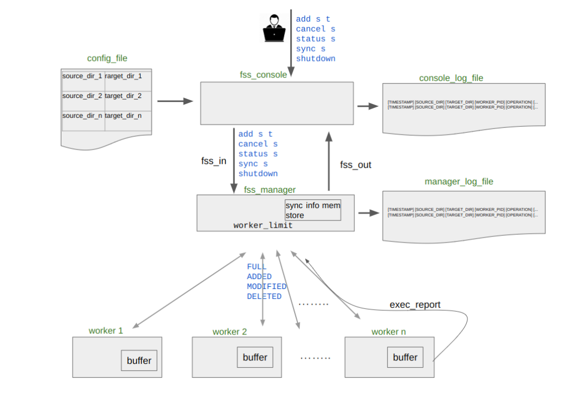

# FileSync System (FSS)


## Overview

FileSync System (FSS) is a directory synchronization system designed to monitor source directories and reflect changes to corresponding target directories. It consists of parts: fss_manager (the main program), fss_console (the user part), and fss_script.sh (for reports and cleanup). The system uses Linux calls like inotify, fork, and exec for synchronization. Console and manager communicate by means of named pipes (fss_out and fss_in).

<div align="center">
  
</div>


### FSS Manager

The FSS Manager is the central component that handles all the synchronization problems. During initialization, it opens two named pipes (fss_in and fss_out) for communication with the console. The fss_in pipe is opened in read-only mode by the manager because it needs to just receive commands from the console. The fss_out pipe is opened in write-only mode by the manager to respond back to the console.

The manager first reads the configuration file containing source-target directory pairs in the line format "source_dir target_dir". Each pair is added to the sync_info_mem_store, a linked list data structure for keeping all the directories. The manager then sets up inotify watches on all source directories and forks worker processes to perform initial full synchronization.

After initialization, the manager enters its main event loop where it monitors a number of file descriptors:

- The fss_in pipe for console commands

- The inotify file descriptor for changes in the filesystem

- Pipes for worker communication to synchronize reports

Once a worker produces output through its pipe (with its stdout redirected through the pipe), the manager will read and process the report. The reports have a standard form with timestamp, source/target paths, operation type, and status. The manager writes this report into manager log file and displays an EXEC_REPORT in its stdout.

The inotify subsystem notifies the manager of filesystem changes in monitored directories. The manager examines these events to determine whether they are file additions, modifications, or deletions, and initiates corresponding worker processes to handle each change.

Console commands received through fss_in initiate different actions:

- "add" commands initiate new monitoring of directories and full synchronization

- "sync" commands initiate full synchronization immediately

- "cancel" commands stop monitoring for specified directories

- "status" commands display ongoing synchronization status

- "shutdown" does orderly shutdown after completing remaining operations

The manager maintains a worker queue when the number of active workers reaches the threshold specified.

### Worker Processes

Worker processes do the actual file synchronization task. They are created by the manager via fork() and exec() when:

- Initial synchronization is needed (from config file)

- Inotify indicates change in watched directories

- User provides sync/add commands from console

Each worker does low-level file operations (open/read/write/unlink) to synchronize the files. The workers send back their results to the manager through pipes, redirecting stdout to the pipe. The manager reads the results and logs them appropriately.

### FSS Console

The fss_console provides user interaction with the system. It reads from fss_in in non-blocking read mode to receive responses from the manager and writes to fss_out in write-only mode to send commands to the manager. By employing the non-blocking mode, it keeps the console active while waiting for responses from the manager.

User commands are first written to the console log file before being passed to the manager. The console continuously watches both user input from stdin and manager responses from fss_out, displaying responses to the user when they arrive.


### FSS Reporting Script

The bash script provides reporting and cleanup in four commands:

- listAll: Displays synchronized directories with timestamp and status

- listMonitored: Displays monitored directories that are still active

- listStopped: Displays directories no longer being monitored

- purge: Deletes target directories or log files


### Compilation and Execution

#### Compilation

- Run ```make``` to build all binaries:
```fss_manager, fss_console, worker```

- Use ```make clean``` to remove build files.

#### Execution

1. Run the manager:
```./fss_manager -l manager.log -c config.txt [-n worker_limit]``` (The worker programs are executed internally by the manager)
2. Run the console:
```./fss_console -l console.log```
3. Run the script:
```./fss_script.sh -p path -c command```

### Implementation Notes

The code has been tested for memory leaks using valgrind. All output formats strictly comply with the requirements of the assignment.