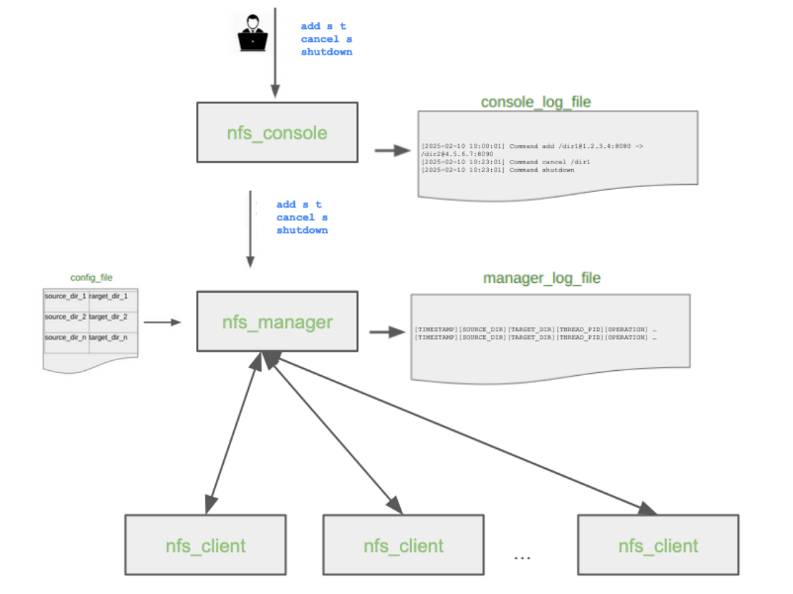

# Network FileSync System


## Overview

Network FileSync System (NFS) is a distributed file synchronization system that synchronizes directories using TCP sockets, worker threads and condition variables. The system consists of three components:

- nfs_manager: Coordinates synchronization tasks and manages worker threads.
- nfs_client: Server that provides file listing, pulling, and pushing services.
- nfs_console: User interface that sends commands to the manager over a TCP connection.

**Note**: This system is designed to work across different machines with different IP addresses, as long as they can reach each other over the network. The manager, clients, and console communicate entirely over TCP sockets, so you can run each component on separate computers—even in different subnets—by specifying the correct hostnames or IPs.

<div align="center">  </div>

### NFS Manager

When the manager starts, it opens the given config file, which has pairs of directories (a source and a target) that need to be synced. Each pair also has information about which host the directories live on and which port the corresponding client is listening to.

The manager stores all this in a simple linked list(sync_info_mem_store). Then, it iterates through each pair, connects to the source client using a TCP socket, and asks it to LIST the contents of the source directory. For each file it finds, it creates a new sync task.

These tasks are added into a queue which is shared between the manager and the worker threads that I set up when the program starts. Each thread waits for work to show up, and when a task is available in the queue, it picks it up and starts syncing that file.

Specifically, the worker opens a socket to the source, sends a PULL command to get the file’s contents, then opens another socket to the target and sends PUSH commands to write the data in chunks there.

Manager also interacts with the console. It opens a single listening socket and accepts one connection from the console. Once the console connects, it keeps that connection alive and uses it to receive commands like:

   - `add`: Add a new sync pair.

   - `cancel`: Stop syncing a specific source directory.

   - `shutdown`: Finish all remaining work and shut everything down.

### NFS Client

Each client is a passive server which listens on a port using TCP. When it gets a connection from the manager, it reads a command and does what it’s told.

It supports three commands:

   -  `LIST <dir>`: It returns a list of filenames in the given directory, one per line, ending with a . to mark the end.

   -  `PULL <path>`: Opens the file and sends the size followed by the content.

   -  `PUSH <path> <chunk_size> <data>`: Writes a chunk of data to a file. If size is -1, it truncates the file first. If it’s 0, it closes the file.

The client works stateless and just reads, writes, and returns. It is designed to handle multiple simultaneous connections by using threads. When a new connection is accepted, client spawns a new thread to handle the session independently, which allows multiple file operations (LIST, PULL, PUSH) to be processed in parallel.

### NFS Console

The console is the interface that the user interacts with the system. It connects to the manager using the host and port given from the command line.

Every time the user types a command (like add, cancel, or shutdown), the console logs it to a file with a timestamp and sends it to the manager over the socket.

Then it waits for a response. To handle the response better, I used the convention that the manager always ends its response with END\n. The console keeps reading until it sees that marker, prints everything it read, and then waits for the next command.

The console, exits along with the manager (when it sends `shutdown` command).

### Compilation and Run

#### Compilation
To compile all programs (`nfs_manager`, `nfs_client`, and `nfs_console`), just run:

```bash
make
```


#### Execution

Start one or more clients (on different ports):

```bash
./nfs_client -p 8000
./nfs_client -p 8001
```

Start the manager (provide your config file and parameters):

```bash
./nfs_manager -l manager.log -c config.txt -n 4 -p 9000 -b 10
```

Start the console (connects to the manager):

```bash
./nfs_console -l console.log -h 127.0.0.1 -p 9000
```

### Implementation Notes

The code has been tested for memory leaks using valgrind. All output formats strictly comply with the requirements of the assignment.